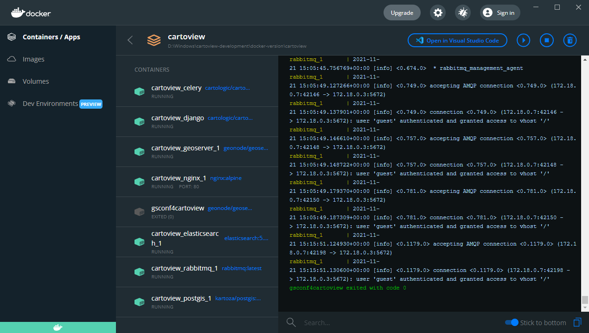
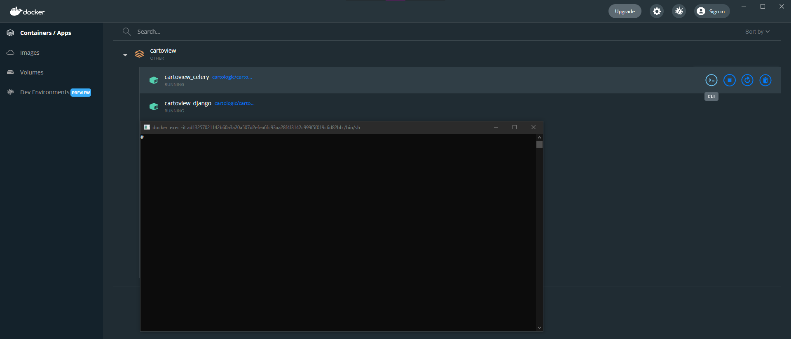
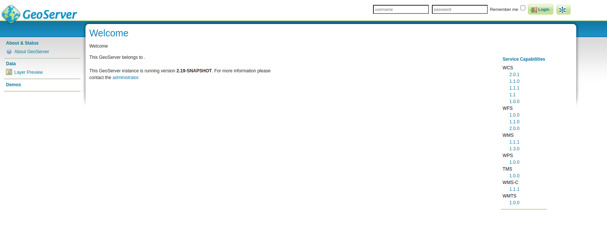

# Cartoview Core Installation | Docker

## Introduction
This guide describes how to install and configure a fresh setup of Cartoview to run it in Production mode using Docker on [**Ubuntu 20.04**](#for-ubuntu-2004) or [**Windows 10**](#for-windows-10).

This part of the documentation describes installation of **Cartoview-1.33.0** which comes with **GeoNode-3.3.0** and **GeoServer-2.19.x**.

---

## Installation Requirements

### For Ubuntu 20.04:

#### Install Docker

In order to be able to run Cartoview with docker engine, Docker Compose should be installed, but because it relies on Docker Engine, we will install``docker`` first from [Docker official website](https://docs.docker.com/get-docker/).

Install **Docker Engine**, follow [this guide](https://docs.docker.com/engine/install/ubuntu/). We recommend installing it using [docker repository](https://docs.docker.com/engine/install/ubuntu/#install-using-the-repository).

Install **Docker Compose**, follow [this guide](https://docs.docker.com/compose/install/).

!!! note
    The Docker daemon needs to use root privileges, so we must prefix each docker command with ``sudo``, but if you want to run them without ``sudo``, check [How to manage Docker as a non-root user](https://docs.docker.com/engine/install/linux-postinstall/#manage-docker-as-a-non-root-user).

Check if Docker is installed successfully.
```shell
docker --version
# Docker version 20.10.10, build b485636

docker-compose --version
# docker-compose version 1.29.2, build 5becea4c
```

### For Windows 10:

#### Install Docker Desktop
Docker Desktop is an easy-to-install application for your Mac or Windows environment that enables you to build and share containerized applications and 
microservices. Docker Desktop includes [Docker Engine](https://docs.docker.com/engine/), Docker CLI client, [Docker Compose](https://docs.docker.com/compose/), and many useful tools.

Walk through this guide to download and install [Docker Desktop](https://docs.docker.com/desktop/windows/install/).

Proceed with installation and leave everything as default.

Docker Desktop does not start automatically after installation. 
To start Docker Desktop, Search for **Docker**, and select **Docker Desktop** in the search results.

When you see the Docker menu (A whale icon) in the taskbar stays steady, **Docker Desktop** is up-and-running, and is accessible from any terminal window.

!!! note
    If you right-click on the whale icon, you can check multiple features like docker version, docker hub, dashboard, etc.
    
    
    
**Docker Dashboard** provides a useful interface to handle and control all the available containers easily. Please visit [Docker Desktop Dashboard](https://docs.docker.com/desktop/dashboard/) for more details.

#### Docker Configuration

Make sure that **Use Docker Compose V2** option is **unchecked** to avoid potential issues.


---

## Cartoview Installation

### Running Cartoview Docker Services
Download **cartoview-1.33.0** by cloning the repository and using the tag **v1.33.0**.

```shell
git clone -b v1.33.0 https://github.com/cartologic/cartoview.git
```

This will create a directory called ``cartoview``. Navigate inside it to build and run Cartoview with docker.

```shell
cd cartoview
docker-compose build --no-cache
docker-compose up -d
```

!!! note
    `-d` is used to start up the containers daemonized, which means they will be started in the background (and keep running if you log out from the server or close the shell). `docker-compose` will take care to restart the containers if necessary (e.g. after boot).

!!! warning
    For **Ubuntu**, if you didn't configure docker to run without ``sudo``, make sure to prefix each docker command with it.
    
Get a cup of coffee and wait until all the images are pulled and installed successfully.

!!! warning
    While installing using **Windows Docker Desktop**, you may be prompted to accept whether to give permission for Docker to mount its containers on one of your hard-drives or to not. Accept this so that the containers can run properly.
    
    If you didn't accept, you will get errors. Execute ``docker-compose up -d`` again and accept.
    
After all images are downloaded, you can monitor the logs of initiating Cartoview with this command.

```shell
# This will show the logs of each service in the docker-compose.yml
docker-compose logs -f --tail=100

# Show logs only for cartoview service
docker-compose logs -f --tail=100 cartoview
```

**For Windows Docker Desktop**

If you open **Docker Dashboard**, you should find the installed containers up and running.


Also, you can see the logs by just ``double-click`` on ``cartoview``.



### Migrate & Load default data
We need to execute post-installation commands (e.g. migrations, collect static files, etc.) to make `cartoview` work properly after it's up and running. So we will open a terminal inside this service to execute these commands.

#### Use Make
If you have [Make](https://www.gnu.org/software/make/) installed on your machine, you can just use the Makefile available at [cartoview](https://github.com/cartologic/cartoview/blob/v1.31.0/Makefile).

!!! note
    - For Windows, if you don't have Make, install it from [here](http://gnuwin32.sourceforge.net/packages/make.htm).
    - Make sure to add `make.exe` path (e.g. C:\Program Files (x86)\GnuWin32\bin) to [PATH system variable](https://www.java.com/en/download/help/path.html). 

!!! warning
    For Windows:
    - All the comments found at the **Makefile** should be removed to avoid any potential errors related to Make.
    - Replace the Unix `sleep` command with Windows `timeout`.
```shell
# This will go through the Makefile and execute the command called "run"
make run
```

!!! note
    The command `make run` will execute a chain of commands that are required to make things work properly. You can check these commands in the `Makefile` available inside cartoview directory.


If you have used the previous command then you can skip the following ones.

#### For Ubuntu:
```shell
docker-compose exec cartoview bash
```

#### For Windows:
Open **Docker Dashboard** and for ``cartoview_django`` container, click on the Cli button to open the terminal in which we will execute the below commands.



This will open a shell inside the container in which we will execute the following commands.

Detect changes in the ``app_manager``.
```shell
python manage.py makemigrations app_manager
```

Migrate the data.
```shell
python manage.py makemigrations
python manage.py migrate
```

Create accounts table.
```shell
python manage.py migrate account
```

Load default User.
```shell
python manage.py loaddata sample_admin.json
```

Load default oauth apps so that you will be able to authenticate with defined external server.
```shell
python manage.py loaddata default_oauth_apps_docker.json
```

Load default Cartoview Appstore data.
```shell
python manage.py loaddata app_stores.json
```

Load default Initial Data for Cartoview.
```shell
python manage.py loaddata initial_data.json
```

!!! note
    After executing the above commands, you can ``exit`` the container terminal by just typing exit then hit the ``Enter`` button.
    
Restart Cartoview services running on docker so that the changes takes effect.

```shell
docker-compose restart
```

#### Test Development Server
Check if Cartoview is working as expected.

In the browser, navigate to [http://10.5.0.4/](http://10.5.0.4/).
!!! note
    Cartoview is running on **10.5.0.4** according to a pre-configured [external IP](https://github.com/cartologic/cartoview/blob/v1.31.0/docker-compose.yml#L111).

!!! warning
    Do Not run Cartoview on **localhost** as it's not configured to work on that.

You should get:


You should be able to successfully log with the default admin user (admin / admin) and start using it right away.

Open GeoServer available at [http://10.5.0.4/geoserver/](http://10.5.0.4/geoserver)


Make sure you're logged in with **admin/admin** in Cartoview at [http://10.5.0.4/](http://10.5.0.4/) then navigate to [http://10.5.0.4/geoserver/](http://10.5.0.4/geoserver/) and click on the 
GeoNode button to use the pre-configured authentication between GeoNode and GeoServer.


!!! note
    You can also log in with the default GeoServer credentials admin/geoserver, but using GeoNode button is easier and quicker.

---

## GeoServer Configuration

### Optional | Change default password

Login with GeoServer credentials that were mentioned above.

At the left-side menu, navigate to **Security** section and click on **Users, Groups, Rules**.


Click on **Users/Groups** then select **admin**.


Set the password you wish then scroll to the end of the page and click **Save**.


    
Now, you can log out and login again with the new password you have just entered.

---

## Post-Installation Notes

Congratulations! Cartoview is now installed successfully.

You can upload layers, create maps, and install Cartoview apps to visualize these maps.

Once Cartoview is installed, You can navigate to the [apps](http://10.5.0.4/cv_apps/) page to check and install all available apps from the [App Store](https://appstore.cartoview.net/).

After installing any app, you may need to restart cartoview docker services in order to install the app properly.
```shell
docker-compose restart
```

Collect static files using the command:
```shell
docker-compose exec cartoview python manage.py collectstatic --noinput
```

Or you can use the [Make](https://www.gnu.org/software/make/) tool to run pre-configured `collectstatic` command.
```shell
# This will go through the Makefile and execute the command called "collect_static"
make collect_static
```
